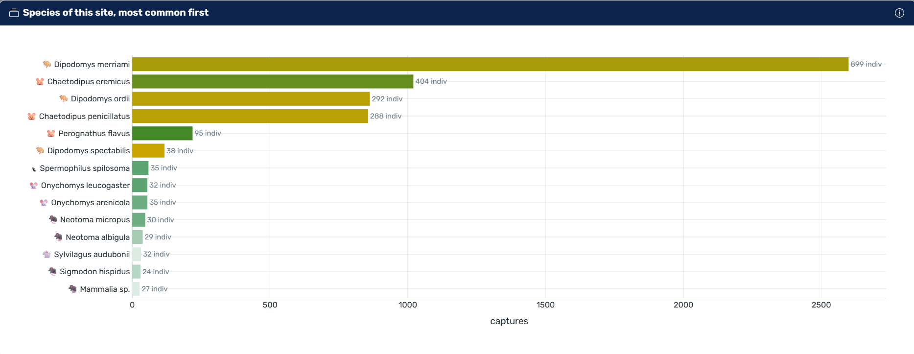
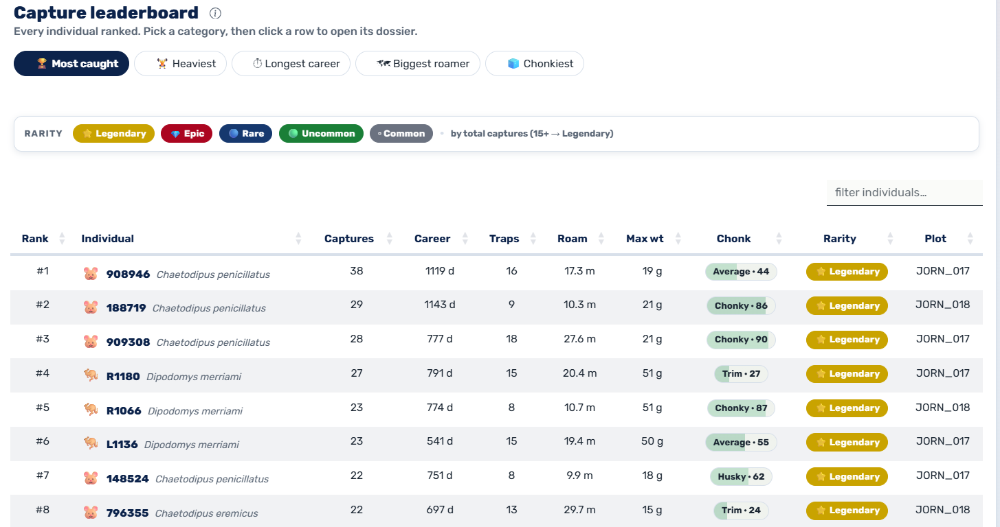
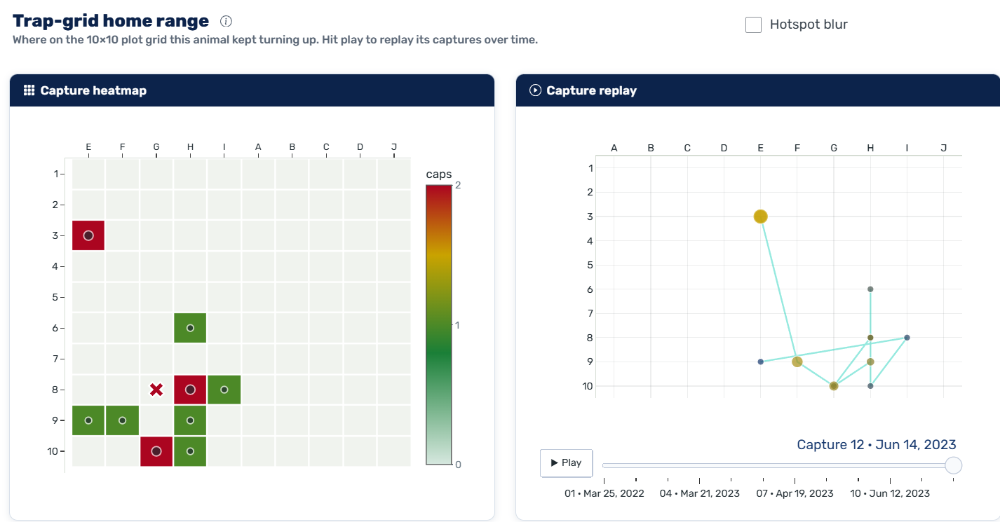
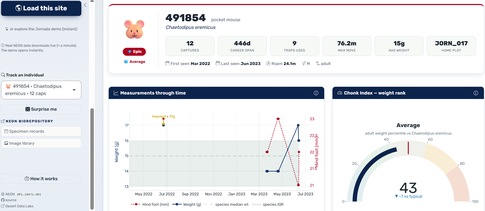
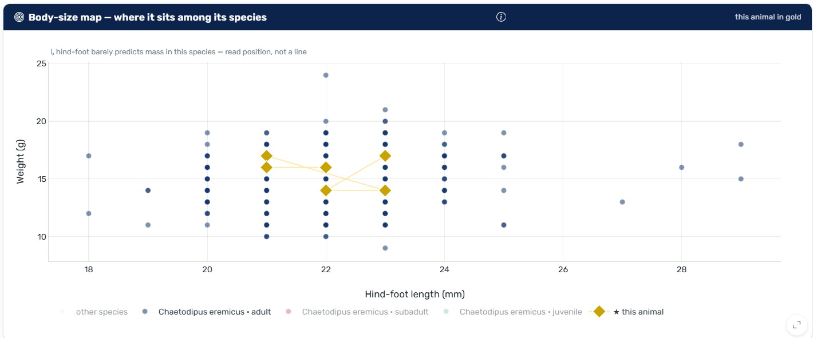
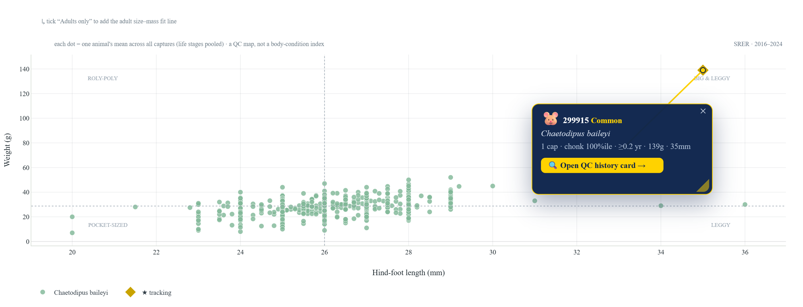
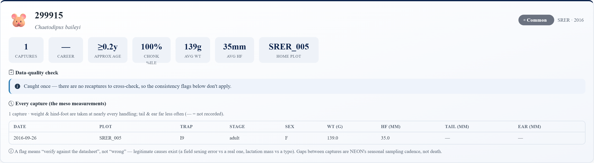
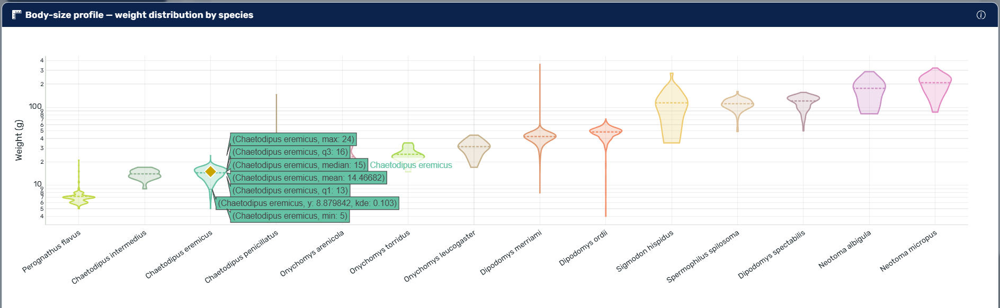
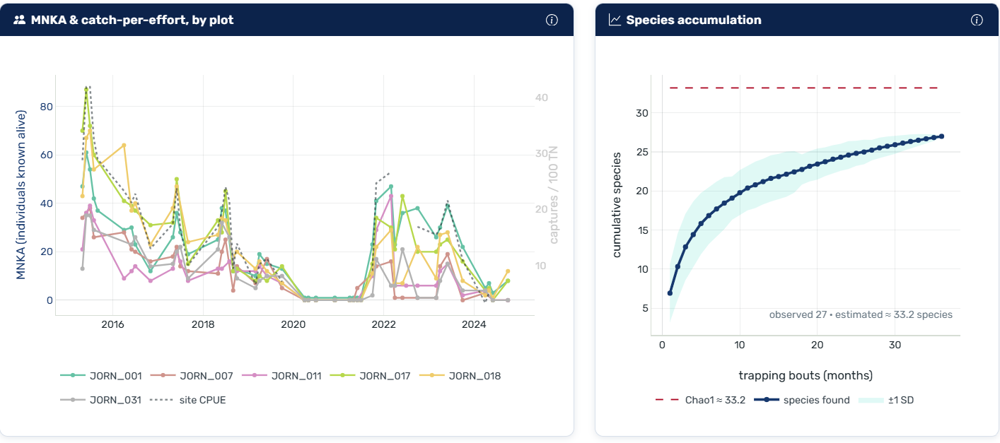
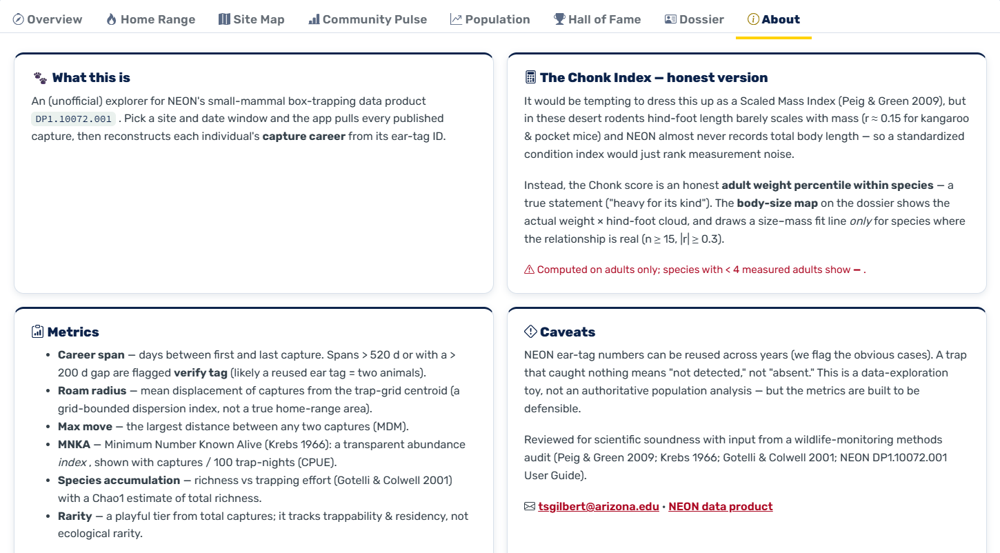

# NEON Small Mammal Tracker

A Shiny web app for exploring the [National Ecological Observatory Network's](https://data.neonscience.org/)
small-mammal box-trapping data — reconstructing each captured animal's history from its ear-tag and
turning 46 field sites of capture records into maps, charts, and individual profiles.

[](https://shiny.posit.co/)
[](https://www.r-project.org/)
[](https://tgilbert14.github.io/NEON-Small-Mammal-Tracker-App/)
[](https://data.neonscience.org/data-products/DP1.10072.001)

**Public status (verified 2026-07-18):** the [Pages landing](https://tgilbert14.github.io/NEON-Small-Mammal-Tracker-App/)
and [Posit Connect Cloud app](https://019ec337-7100-317e-5052-c3bf32ffcb79.share.connect.posit.cloud/)
are healthy. Production serves runtime merge `1615ab4`; semantic health requires the app-specific
ready marker and passed on that exact revision.

Connect's source points at `main`, but automation never writes there directly. Validated monthly
refreshes are published to `automation/small-mammal-data-refresh` as a review PR; an intentional
merge plus a verified Connect republish is the production decision.



---

## What it does

The app opens to a **national map of every NEON site** — tap a dot to dive in (dot size = animals
caught there, color = the dominant mammal family), or flip to **"by species"** to map where a single
animal turns up across the country. Each site loads instantly from a per-site data bundle that ships
with the app (no network round-trip). From there it reconstructs each animal's capture history from
its ear-tag ID, ranks the regulars, profiles individuals, estimates abundance, and maps where they
were caught. The map is the site picker; once a site is open, a "change site" link in the top bar
takes you back to it.

It is built for two audiences: anyone curious about NEON small-mammal sampling, and new field
technicians getting to know the species at their site.

## Highlights

**Select-your-site map.** A national Leaflet map of all 46 bundled sites — sized by total captures,
colored by the most-caught mammal family — with a "by site / by species" toggle, an accessible list
fallback, and a one-tap load. A 30-second guided tour points out the rest.

**Explore by species.** Pick any of 145 species and the map redraws to just the sites where it's
caught, sized by local abundance — a live national range map.

**Detection-corrected abundance.** Closed-capture estimates per trapping bout (Schnabel for ≥3
nights, Chapman for 2) with a per-night detection probability, shown alongside MNKA, gated when
recaptures are too few, and clamped to the minimum known alive — defensible, with caveats shown.

**Diversity profile.** Hill numbers (q0 richness, q1 effective-common, q2 effective-dominant) plus
an evenness read, computed over distinct individuals.

**Shareable trading cards, compare, and report cards.** Export any individual's dossier as a
holographic PNG trading card, put two sites head-to-head, or print a one-page site report card to PDF.

**Overview — the story of a site.** Species ranked by abundance, an automatically written
plain-English summary, and quick-jump navigation to every view.

**Hall of Fame — rank every individual.** A top-3 **podium** over a leaderboard of every animal,
re-sortable by captures, weight, career length, roaming, or weight-for-its-species, with rarity tiers
and a Legendary shimmer. Each **dossier** opens with a computed one-line "story" — the animal's standout
stat ranked against its peers ("the most-caught individual at this site") — and count-up stats.



**Site map.** Species diversity by plot on a satellite basemap; the selected individual's plots are
highlighted. An optional **recapture-movement** layer draws curved arcs between grids where the same
tagged animals were recaptured (thicker = more individuals made the move) — the between-grid
connectivity the dots can't show, framed honestly as mark-recapture, not telemetry.



**Measurements over time.** An individual's weight and hind-foot length tracked across captures,
against the species' typical range.



**Body-size map.** Where an animal sits in its species' weight-by-length cloud, with a fitted
size–mass line drawn only where the relationship is statistically real.



**Size Lab — an interactive QC workbench.** Every individual at the site on one **body-size map**
(hind-foot length × weight, coloured by species). **Pick a species** (and plot) to add its median
crosshairs and an adult size–mass fit line — drawn *only* where length really predicts mass. **Tap any
dot to pin its card**, drag it around, and open the **QC history card** for that animal: every capture's
measurements plus **automatic, ranked data-quality flags** (phrased *"verify, not wrong"* — a same-tag-at-
two-plots impossibility, a backward life-stage, an implausible weight jump, a sex flip…). Then **download
the works** — the whole map with the pins baked in, the QC card as a PNG, or the animal's full capture
history as **CSV metadata** (an analysis-ready field record). Framed throughout as a *QC / morphometric
map, not a body-condition index* — a dot far from its species' cloud flags an unusual or mistyped record,
not "fitness."





**Community body-size profile.** The weight distribution of every species at a site, lightest to
heaviest, with the selected animal marked.



**Population signals.** Minimum Number Known Alive (MNKA), catch-per-unit-effort, and a
species-accumulation curve with a Chao1 richness estimate.



It also includes a trap-grid home-range heatmap with an animated capture replay, a breeding-phenology
chart, and tap-any-statistic ranked breakdowns.

## How the numbers work

| Metric | Definition |
| --- | --- |
| Captures | Times an individual (ear-tag ID) was handled in the window. |
| Career span | Days between an individual's first and last capture. These desert rodents genuinely live 1–3.5 yr, so long careers are kept as real; only a history that can't be one animal (the same tag at two plots on a single day, or a span beyond any wild lifespan) is flagged `verify tag`. |
| Roam radius / Max move | Mean displacement from, and maximum distance between, capture locations (traps are 10 m apart). A grid-bounded dispersion index, not a true home-range area. |
| Chonk Index | Adult weight percentile within species. NEON rarely records body length and hind-foot barely scales with mass in these taxa, so a Scaled Mass Index would mostly rank noise — the body-size map shows the real relationship where it exists. |
| MNKA / CPUE | Minimum Number Known Alive (Krebs 1966) and captures per 100 trap-nights — transparent abundance indices. |
| Recapture rate | Share of handling events flagged as recaptures. |
| Detection-corrected abundance | Closed-capture estimate (Schnabel for ≥3-night bouts, Chapman for 2; Otis et al. 1978) with a per-night detection probability — corrects the count for animals never caught. Gated to ≥3 within-bout recaptures and floored at MNKA. |
| Species richness / Chao1 | Cumulative species vs trapping bouts (Gotelli & Colwell 2001). Chao1 is a **bias-corrected minimum** estimate of total richness, S_obs + f1(f1−1)/(2(f2+1)) (Chao 1987; Chao & Chiu 2016), shown with a 95% CI and flagged as a lower bound when doubletons are scarce. Counts **confirmed species-level IDs only** — genus-only "X sp." and ambiguous "A/B" records are excluded (matching the range map and the diversity profile), so an unidentified catch isn't counted as its own species. |
| Hill numbers | Effective number of species at q = 0 (richness), 1 (exp-Shannon, common species), 2 (inverse-Simpson, dominant species), over distinct individuals per species (Hill 1973; Jost 2006). |

Methods reviewed against Peig & Green (2009), Krebs (1966), Gotelli & Colwell (2001), Chao (1987),
Chao & Chiu (2016), and Otis et al. (1978). Chao1 is a lower-bound estimator, not a prediction of true
richness; genus-only and ambiguous identifications are excluded from richness and diversity. NEON
keeps a tag on one animal for life and does not recycle tag numbers (a number is unique within a
site), so a multi-year career is a real long-lived individual — we flag only the rare impossible
history (e.g. the same tag at two plots on a single day), not long careers. An empty trap means
"not detected," not "absent."



## Data

All records come from NEON data product
[DP1.10072.001 — Small Mammal Box Trapping](https://data.neonscience.org/data-products/DP1.10072.001),
pre-downloaded with [`neonUtilities::loadByProduct()`](https://www.neonscience.org/neonUtilities).

Each site's full record is pre-downloaded into `data/sites/<SITE>.rds` (trimmed and compressed), and
two national indexes (`data/site_index.rds`, `data/species_ranges.rds`) power the picker and range
maps — so the app runs **entirely from the bundle, instantly, with no `neonUtilities` dependency at
runtime.** `neonUtilities` is optional: it's loaded lazily only for the live-fetch toggle, which
appears only where the package is installed (set `SMT_LIVE=0` to force bundle-only). A GitHub Action
prepares a refreshed candidate **late on the first Saturday night of each month** (~11 pm Arizona
time), verifies it, and opens or updates a review PR. Production changes only after an intentional
merge; the approach is documented in
[docs/data-bundling-pattern.md](docs/data-bundling-pattern.md).

### Compare with environment (co-located NEON overlays)

The sidebar's **Compare with environment** picker overlays a *co-located* NEON data product —
measured at the **same site** — behind the population and seasonality charts (MNKA, detection-corrected
abundance, breeding phenology), with a **lead-time (lag) slider** so you can shift a driver forward and
watch, say, a rain pulse line up under the rodent boom it feeds months later. Available layers:

| Layer | NEON product | Aggregation | Site coverage |
| --- | --- | --- | --- |
| Precipitation | `DP1.00044.001` (weighing gauge) | monthly sum (mm) | 19 / 46 |
| Air temperature | `DP1.00002.001` (single-aspirated) | monthly mean/min/max (°C) | 46 / 46 |
| Plants flowering | `DP1.10055.001` (phenology) | monthly % of individuals in "Open flowers" | 46 / 46 |
| Green-up (leaf-out) | `DP1.10055.001` (phenology) | monthly % of individuals in early leaf-out | 46 / 46 |
| Plants fruiting | `DP1.10055.001` (phenology) | monthly % of individuals in "Fruits" | 36 / 46 |

Each layer is pre-aggregated to **one value per site-month** and bundled as a tiny `data/env/<SITE>.rds`
(a few KB) by `scripts/refresh_env_data.R`, mirroring the mammal bundle and shipped with the app — so
the overlays are **real NEON data**, not a demo. The picker only offers a layer when that site actually
has data for it (`env_layer_choices()`), so a missing layer simply doesn't appear — the feature never
shows an empty overlay. Where a site lacks an env bundle entirely, the app falls back to a small,
clearly-badged **illustrative demo** series (`data-sample/env_demo.csv`).

**Phenology — three signals, not one.** NEON's phenology product tracks many phenophases, not just
fruiting. We derive three: **flowering** (`Open flowers`), **green-up** (early leaf-out: young
leaves/needles, breaking buds, increasing leaf size, initial growth), and **fruiting** (`Fruits`).
Flowering and green-up are the *lead drivers at arid sites* — the desert/grassland sites the app centers
on (SRER, JORN) have **no fruiting phenophase at all** but rich flowering + green-up, and green-up
doubles as a precipitation-pulse proxy where NEON has no rain gauge. Fruiting is the *mast/forest* lead
(autumn acorn → next-summer mice). Each is a **monthly status yes-share** — the share of monitored
individuals in that phenophase — computed at the individual×month grain, with `'uncertain'`/blank
excluded and months backed by fewer than 5 individuals suppressed to `NA` (a companion `_n` column
carries the count). This is the metric NEON's own R tutorial uses; binned *intensity* is deliberately
**not** averaged (its bins are ordinal and incommensurable across phenophases).

Coverage varies by product: NEON publishes precipitation at only ~24 sites observatory-wide (19 of our
46), so precip is genuinely absent at the rest; flowering and green-up are recorded at all 46. Air
temperature is pulled with `timeIndex = 30` (30-minute table only). Relative humidity and **soil
moisture** are deliberately not built (soil water is a very-high-volume product). The full multi-year
history is built **offline** once (run `scripts/refresh_env_data.R`, then commit `data/env/`); the
monthly Action then runs a **light top-up** (`SMT_ENV_RECENT_MONTHS=14`) that re-pulls only the last
~14 months and merges them into the committed bundle, so the overlays stay current without a full
13-year re-pull. The top-up is time-boxed and non-fatal: if it fails, the mammal bundle and index
candidate can still proceed to review, and the run logs a loud warning that the overlays were not
topped up.

**Honest lag correlations.** The "which driver does this population track?" panel scans 0–12-month lags
for the strongest correlation with catch-per-effort. To keep that defensible: both series are
**deseasonalized** (calendar-month anomalies) before correlating — so a match reflects year-to-year
covariation, not a shared "both peak in summer" cycle — the overlap floor is **n ≥ 8 months**, and the
panel labels the search ("best of N drivers × ≤13 lags") and flags that the bars are correlated stages
of one seasonal cascade, *not* independent evidence. The result is stated as a plain-English **answer**
("a moderate link with air temperature, r = −0.50"), with a popover that explains *r* in lay terms —
it's the correlation, **not** the percentage of the population explained (that's r²) — and the driver
bars use an intuitive, colour-blind-safe palette: warm/cool for a positive/inverse temperature link,
green/brown for vegetation.

## Run it locally

```r
install.packages(c(
  "shiny", "bslib", "bsicons", "shinyjs", "shinycssloaders",
  "plotly", "dplyr", "tidyr", "stringr", "tibble",
  "RColorBrewer", "leaflet", "DT", "htmltools", "ggplot2"
))
# ggplot2 (with grid/grDevices, which ship with R) powers the printable PDF report card.
# neonUtilities is OPTIONAL — only needed for the live-fetch toggle:
# install.packages("neonUtilities")

shiny::runApp()
```

The app opens to the national site-picker map of all 46 NEON sites. Tap a site to load it. Once a
site is open, the top bar carries a "change site" link (back to the map) and a "report" button; pick
your date range right on the map page.

## Project layout

```
global.R                  libraries, theme, data loaders, lazy NEON fetch
ui.R                      bslib dashboard (map-picker splash + hero + tabs)
server.R                  data flow and all outputs (incl. picker/range maps)
R/helpers.R               analytical engine (leaderboards, indices, closed-capture, Hill)
R/site_metadata.R         site code -> name / state / domain / bio
www/                      theme CSS and JS (counters, loader, confetti, tour, card export)
data/sites/               per-site .rds bundle ("the database")
data/site_index.rds       national picker-map index (per-site stats)
data/species_ranges.rds   per-species national ranges (the "by species" map)
scripts/refresh_data.R    rebuild the per-site data bundle
scripts/refresh_env_data.R  build per-site monthly environmental overlays (data/env/)
scripts/build_site_index.R  rebuild the picker + species-range indexes
scripts/make_og_image.R   legacy code-native social-card fallback
scripts/write_manifest.R  (re)generate manifest.json for Connect Cloud (lean, bundle-only)
scripts/test_helpers.R    fail-closed fixture contracts for scientific helpers
scripts/verify_bundle.R   exact site/schema/index/checksum/package release gates
docs/BUILD-TEST-HANDOFF.md  chronological build/test/deploy evidence
docs/                     landing page + og card, design & data-bundling write-ups
DEPLOY.md                 deploy & migration runbook (Connect Cloud / shinylive / Pages)
```

## Deploy

Posit Connect Cloud is git-backed and watches `main`, so a reviewed merge can republish the app. The
refresh workflow follows a producer → validator → restricted-publisher model: it builds in an empty
stage, verifies the exact 46-site bundle, indexes, manifest and offline app source, then opens or
updates a review PR. It never pushes to `main`. There are no shinyapps secrets or `deployApp()` step.

The Connect manifest is generated under pinned R 4.5.2 with a dated Posit snapshot plus an exact
eight-package CRAN geospatial closure. The writer verifies the versions and honest repository lanes;
it never fabricates versions after generation. Heavy live-fetch packages (`neonUtilities`, `arrow`)
remain excluded from the runtime manifest. Main publication triggers semantic checks against both the
Connect app and Pages landing; a failure opens or updates a production-outage issue. See
**[DEPLOY.md](DEPLOY.md)** and **[the evidence handoff](docs/BUILD-TEST-HANDOFF.md)**.

## Built by Desert Data Labs

Custom data apps, dashboards, and analytics for science, sports, and beyond. Want one for your
project? **desertdatalabs@gmail.com** · [desertdatalabs.com](https://desertdatalabs.com)

Not affiliated with NEON, Battelle, or the NSF. An educational data-exploration tool.
